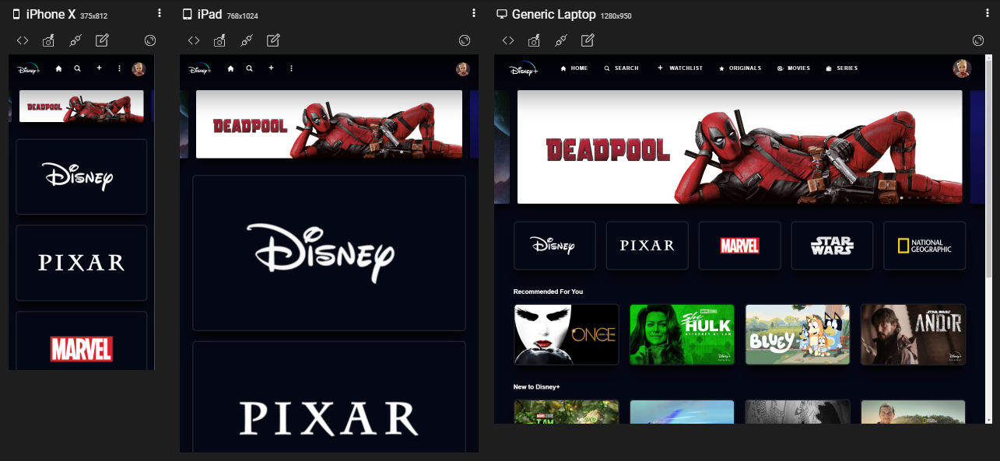

<h1 align="center">
    
</h1>

<br>

<p align="center">
  
</p>

<h4 align="center">
  Disney+ is the streaming service for movies, series and other content from Disney, Pixar, Marvel, Star Wars, National Geographic and more.
</h4>

---

[We are ONLINE, try Now](https://disney-clone-bcb41.web.app) :point_left:

<br>

<p align="center">
  <a href="#test_tube-technologies">Technologies</a>&nbsp;&nbsp;&nbsp;|&nbsp;&nbsp;&nbsp;
  <a href="#rocket-Getting-started">Getting started</a>&nbsp;&nbsp;&nbsp;|&nbsp;&nbsp;&nbsp;
  <a href="#desktop_computer-Project">Project</a>&nbsp;&nbsp;&nbsp;|&nbsp;&nbsp;&nbsp;
  <a href="#bookmark-Layout">Layout</a>&nbsp;&nbsp;&nbsp;|&nbsp;&nbsp;&nbsp;
  <a href="#clapper-Demonstration">Demonstration</a>&nbsp;&nbsp;&nbsp;|&nbsp;&nbsp;&nbsp;
  <a href="#sunny-result">Result</a>
</p>

## :test_tube: Technologies

This project was developed using the following technologies:

- [React.JS](https://reactjs.org)
- [React Skeleton](https://www.npmjs.com/package/react-loading-skeleton)
- [React Slick](https://react-slick.neostack.com/)
- [Firebase](https://firebase.google.com/)
- [Styled Components](https://styled-components.com/)


## :rocket: Getting started

To clone and run this application, you'll need [Git](https://git-scm.com), [Node.js v14.17.2][nodejs] or higher + [Yarn v1.22.0][yarn] or higher installed on your computer. From your command line:

Clone the project and access the folder

```bash
$ https://github.com/Ivo-Jr/disney-clone.git && cd disney-clone
```

Follow the steps below
```bash
# Install the dependencies
$ yarn

# Start the project
$ yarn dev
```

## :desktop_computer: Project

This app simulates the Disney+ streaming service where users can login after prior authentication and then choose a listed movie and read its synapse

## :clapper: Demonstration

  <div style="display: flex;   flex-direction: column; align-items: center; margin: 15px 0px">
        
  </div>

---

## :sunny: Result

<h3>Responsive Layout:<h3>

  <div style="display: flex;   flex-direction: column;
  align-items: center;">
  <h1 align="center" style="display: flex; flex-direction:row;">
      
  </h1>     
  </div>

  <div style="display: flex; flex-direction: column;
  align-items: center;">
  <h1 align="center" style="display: column; flex-direction:row;">
      
      <div style="display: flex; justify-content: center">
        
        
      </div>
  </h1>  


<p align="center">Made with ❤ by Ivo Jr</p>
